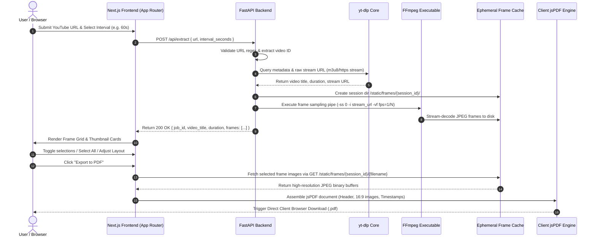

# System Architecture & Technical Blueprint

**Document Version:** 1.0.0  
**Author:** Principal Software Architect & Lead Systems Engineer  
**Status:** Approved Architectural Blueprint  

---

## 1. End-to-End Application Flow Diagram

The diagram below details the end-to-end data lifecycle, from initial client URL submission through non-download stream resolution, server-side FFmpeg frame extraction, static frame serving, client-side React gallery curation, and browser-based PDF generation.



---

## 2. Technology Stack & Architectural Boundaries

| Layer | Component / Tool | Version / Standard | Architectural Rationale & Responsibility |
| :--- | :--- | :--- | :--- |
| **Frontend Framework** | Next.js (App Router) | React 18+ / Next.js 14+ | Server-side rendered shell, client-side interactive gallery, modular UI components, zero layout shifts. |
| **Frontend Language** | TypeScript | 5.0+ | Strict type safety across API schemas, frame selection states, and PDF layout parameters. |
| **Styling & UI** | Tailwind CSS + Lucide React | 3.4+ | Utility-first, zero-runtime overhead, high-contrast dark/light design system primitives. |
| **Client PDF Engine** | jsPDF | 2.5+ | **Client-Side Boundary:** Executes canvas-to-PDF compilation directly in browser thread. Zero backend CPU/RAM burden for PDF rendering. |
| **Backend Framework** | FastAPI (Python) | 0.100+ | Asynchronous event loop, high-performance HTTP endpoints, native Python subprocess execution for FFmpeg. |
| **Media Resolver** | `yt-dlp` | Latest CLI / PyPI | Extract raw HLS/HTTPS stream manifests directly from YouTube servers without downloading media. |
| **Frame Extraction** | FFmpeg | 6.0+ CLI | Direct HTTP stream demuxing and hardware-accelerated video frame sampling into high-quality JPEG assets. |
| **Static Asset Server** | FastAPI StaticFiles | Built-in | Serves temporary session frame images to client browser with CORS headers. |

---

## 3. Repository Directory Structure

The project follows a clean, decoupled monorepo layout split cleanly into `/frontend` (Next.js App Router) and `/backend` (FastAPI).

```
vidnote-ai/
├── PRD.md
├── Architecture.md
├── Rules.md
├── Phases.md
├── Design.md
├── why.md
├── README.md
├── backend/
│   ├── app/
│   │   ├── __init__.py
│   │   ├── main.py                   # FastAPI Application Entrypoint & CORS
│   │   ├── config.py                 # Application Settings & Path Definitions
│   │   ├── api/
│   │   │   ├── __init__.py
│   │   │   ├── endpoints.py          # API Routers (/api/extract, /api/health)
│   │   │   └── schemas.py            # Pydantic Request/Response Models
│   │   ├── services/
│   │   │   ├── __init__.py
│   │   │   ├── stream_resolver.py    # yt-dlp Stream Manifest Resolution Service
│   │   │   ├── frame_extractor.py    # FFmpeg Subprocess Frame Sampling Pipeline
│   │   │   └── cleanup_service.py    # Background Ephemeral Storage Purge Cron
│   │   └── utils/
│   │       ├── __init__.py
│   │       └── validators.py         # YouTube URL Regex & Duration Validators
│   ├── static/
│   │   └── frames/                   # Ephemeral frame storage directory (1-hour TTL)
│   │       └── .gitkeep
│   ├── tests/
│   │   ├── test_extract.py
│   │   └── test_validators.py
│   ├── requirements.txt              # FastAPI, yt-dlp, uvicorn, pydantic dependencies
│   ├── Dockerfile
│   └── .env.example
├── frontend/
│   ├── src/
│   │   ├── app/
│   │   │   ├── layout.tsx            # Global Root Layout & Font Definitions
│   │   │   ├── page.tsx              # Main Application View & Gallery Shell
│   │   │   └── globals.css           # Tailwind Directives & Custom Scrollbars
│   │   ├── components/
│   │   │   ├── UrlForm.tsx           # YouTube URL Input & Interval Selector
│   │   │   ├── FrameGrid.tsx         # Responsive Card Grid Container
│   │   │   ├── FrameCard.tsx         # Interactive Thumbnail Card (Selection/Badges)
│   │   │   ├── SelectionToolbar.tsx  # Batch Select/Deselect & Counter Bar
│   │   │   ├── ModalPreview.tsx      # Full-Screen Image Lightbox Preview
│   │   │   ├── PdfExportBar.tsx      # Sticky Export Controls & Layout Switcher
│   │   │   └── SkeletonGrid.tsx      # Loading Skeleton State Component
│   │   ├── lib/
│   │   │   ├── api.ts                # Axios/Fetch API Client for Backend
│   │   │   ├── pdfGenerator.ts       # jsPDF Document Compilation Engine
│   │   │   └── utils.ts              # Timecode formatting & helper utility functions
│   │   └── types/
│   │       └── index.ts              # TypeScript Interfaces (Frame, Job, PDFOptions)
│   ├── public/
│   │   └── favicon.ico
│   ├── package.json
│   ├── tsconfig.json
│   ├── tailwind.config.js
│   ├── postcss.config.js
│   └── Dockerfile
└── docker-compose.yml
```

---

## 4. API Specification & Interface Contracts

### 4.1 `POST /api/extract`
Submits a YouTube URL to extract video frames at the specified interval.

#### Request Schema (`application/json`)
```json
{
  "url": "https://www.youtube.com/watch?v=dQw4w9WgXcQ",
  "interval_seconds": 60
}
```

- `url` (string, required): Valid YouTube video URL matching accepted patterns.
- `interval_seconds` (integer, optional): Interval in seconds between extracted frames. Options: `15`, `30`, `60` (default), `120`, `300`. Minimum: `10`, Maximum: `600`.

#### Response Schema (`200 OK`)
```json
{
  "job_id": "c9a4b8e2-5f12-4d33-91ab-687f4c6e112d",
  "video_id": "dQw4w9WgXcQ",
  "video_title": "Rick Astley - Never Gonna Give You Up (Official Music Video)",
  "duration_seconds": 213,
  "total_frames": 4,
  "interval_seconds": 60,
  "frames": [
    {
      "frame_id": 0,
      "filename": "frame_0000.jpg",
      "url": "http://localhost:8000/static/frames/c9a4b8e2-5f12-4d33-91ab-687f4c6e112d/frame_0000.jpg",
      "timestamp_seconds": 0,
      "timestamp_formatted": "00:00:00"
    },
    {
      "frame_id": 1,
      "filename": "frame_0001.jpg",
      "url": "http://localhost:8000/static/frames/c9a4b8e2-5f12-4d33-91ab-687f4c6e112d/frame_0001.jpg",
      "timestamp_seconds": 60,
      "timestamp_formatted": "00:01:00"
    },
    {
      "frame_id": 2,
      "filename": "frame_0002.jpg",
      "url": "http://localhost:8000/static/frames/c9a4b8e2-5f12-4d33-91ab-687f4c6e112d/frame_0002.jpg",
      "timestamp_seconds": 120,
      "timestamp_formatted": "00:02:00"
    },
    {
      "frame_id": 3,
      "filename": "frame_0003.jpg",
      "url": "http://localhost:8000/static/frames/c9a4b8e2-5f12-4d33-91ab-687f4c6e112d/frame_0003.jpg",
      "timestamp_seconds": 180,
      "timestamp_formatted": "00:03:00"
    }
  ]
}
```

#### Error Response Schemas
- **400 Bad Request:** Invalid YouTube URL syntax or unsupported live stream.
```json
{
  "detail": "Invalid YouTube URL format. Provide a valid watch, embed, or short URL."
}
```
- **422 Unprocessable Entity:** Video is private, age-restricted, or video duration exceeds 4-hour limit.
```json
{
  "detail": "Video duration (280 minutes) exceeds maximum allowed limit of 240 minutes."
}
```
- **504 Gateway Timeout:** FFmpeg stream extraction timed out.
```json
{
  "detail": "Stream extraction timed out while connecting to YouTube media server."
}
```

---

### 4.2 `GET /static/frames/{job_id}/{filename}`
Delivers static JPEG frame assets stored in the ephemeral cache directory.

#### Headers & Lifecycle Policy
- **Cache-Control:** `public, max-age=3600, immutable`
- **Content-Type:** `image/jpeg`
- **Storage Cleanup Policy:** Frames are stored under `/static/frames/{job_id}/`. An asynchronous background task checks creation timestamps (`ctime`) every 15 minutes and automatically purges job directories older than 60 minutes.
