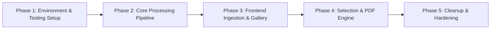

# Implementation Roadmap & Phase Breakdown

**Document Version:** 1.0.0  
**Author:** Principal Software Architect & Lead Systems Engineer  
**Status:** Implementation Roadmap  

---

## Roadmap Overview

Development is divided into 5 sequential, verifiable phases. Each phase requires explicit criteria verification before proceeding to the next.



---

## Milestone Phase Breakdown

### Phase 1: Environment & Tooling Setup
**Goal:** Establish clean repository scaffolding, verify binary dependencies (FFmpeg, Python 3.10+, Node.js 18+), and configure base FastAPI & Next.js projects.

#### Deliverables & Tasks
1. **Backend Environment Initialization:**
   - Setup Python virtual environment (`venv`) and install `fastapi`, `uvicorn`, `yt-dlp`, `pydantic`.
   - Verify system FFmpeg binary availability via `ffmpeg -version` check utility.
   - Configure basic FastAPI application shell in `backend/app/main.py` with CORS middleware.
2. **Frontend Project Scaffolding:**
   - Initialize Next.js 14 App Router project with TypeScript and Tailwind CSS.
   - Install `lucide-react`, `jspdf`, `axios`, `clsx`, `tailwind-merge`.
   - Setup custom dark/light theme Tailwind primitives in `tailwind.config.js` and `globals.css`.
3. **Environment & Configuration:**
   - Define `.env.example` for both backend and frontend (`PORT`, `CORS_ORIGINS`, `MAX_VIDEO_DURATION_MINUTES`).

#### Verification Criteria
- `curl http://localhost:8000/api/health` returns `200 OK {"status": "healthy"}`.
- Running `ffmpeg -version` inside FastAPI startup lifecycle prints valid version string.
- Next.js dev server runs cleanly on `http://localhost:3000` without TypeScript errors.

---

### Phase 2: Core Processing Pipeline
**Goal:** Build the non-download video processing pipeline: URL validation -> stream resolution via `yt-dlp` -> frame sampling via FFmpeg -> static serving.

#### Deliverables & Tasks
1. **URL Validation & Metadata Service:**
   - Implement regex URL parser in `validators.py` supporting `youtube.com/watch`, `youtu.be`, `shorts`, and `embed` patterns.
   - Implement `stream_resolver.py` using `yt-dlp` Python API to extract video metadata (title, duration, thumbnail, stream URL).
2. **FFmpeg Frame Extraction Engine:**
   - Implement `frame_extractor.py` executing async non-blocking FFmpeg subprocesses:
     ```bash
     ffmpeg -ss 00:00:00 -i <stream_url> -vf "fps=1/60" -q:v 2 static/frames/{job_id}/frame_%04d.jpg
     ```
   - Calculate precise timecodes for each frame (`timestamp_seconds = frame_index * interval_seconds`).
3. **Static File Delivery Endpoint:**
   - Configure FastAPI `StaticFiles` mounting `/static/frames` directory for instant client fetching.
   - Implement `POST /api/extract` router connecting validation, stream resolution, extraction, and metadata response creation.

#### Verification Criteria
- Submit test YouTube URL to `POST /api/extract` via Postman/cURL.
- Verify job completes in under 15 seconds for a 30-minute video.
- Confirm frame images are created in `static/frames/{job_id}/` and accessible via HTTP GET.

---

### Phase 3: Frontend Ingestion & Frame Gallery
**Goal:** Build responsive Next.js user interface for submitting video URLs, viewing processing states, and interacting with the frame gallery grid.

#### Deliverables & Tasks
1. **Ingestion & Validation UI (`UrlForm.tsx`):**
   - Build URL input bar with real-time regex validation and instant error feedback.
   - Interval dropdown selector (`15s`, `30s`, `1 min`, `2 min`, `5 min`).
2. **Skeleton & Loading States (`SkeletonGrid.tsx`):**
   - Animated shimmer loading skeletons providing visual feedback while backend stream extraction is active.
   - Progress status indicator (e.g. "Resolving stream...", "Sampling frames every 60s...").
3. **Responsive Frame Grid (`FrameGrid.tsx` & `FrameCard.tsx`):**
   - Render 16:9 thumbnail cards with timestamp badges (`00:01:00`).
   - Image lazy-loading and hover transition effects.
4. **Full-Screen Lightbox Modal (`ModalPreview.tsx`):**
   - High-resolution image preview modal with keyboard navigation (Left/Right arrows, Escape key).

#### Verification Criteria
- Pasting invalid YouTube URL displays inline red validation warning.
- Submitting valid URL triggers loading state, followed by rendering correct number of frame cards.
- Clicking any frame card opens full-screen modal preview.

---

### Phase 4: Selection Logic & PDF Generation Engine
**Goal:** Implement multi-selection state management, batch actions, sticky export control bar, and browser-based `jsPDF` compilation.

#### Deliverables & Tasks
1. **Selection State Management:**
   - React state tracking selected `frame_id` set.
   - "Select All", "Deselect All", and "Invert Selection" batch functions.
   - Real-time selection counter badge ("12 of 30 frames selected").
2. **PDF Configuration & Controls (`PdfExportBar.tsx`):**
   - Sticky bottom action bar displaying layout options:
     - 1 Frame per page (Full slide layout).
     - 2 Frames per page (Compact study guide layout).
   - "Export PDF" CTA button with processing spinner.
3. **jsPDF Compilation Service (`pdfGenerator.ts`):**
   - Client-side canvas conversion to JPEG base64 data.
   - Render document headers (Video Title, YouTube URL, Export Date).
   - Calculate scaled 16:9 image positioning with centered margins.
   - Render timestamp footer badges (`Timestamp: HH:MM:SS`) and page numbers (`Page X of Y`).
   - Trigger direct browser file download (`Title_Notes.pdf`).

#### Verification Criteria
- Clicking "Select All" checks all frame checkboxes; clicking "Deselect All" unchecks all.
- Generating PDF with 1-frame-per-page creates clean A4 document with 1 slide per page, centered, with timestamp footers.
- Generating PDF with 2-frames-per-page cleanly stacks 2 slides per page without overlapping text.

---

### Phase 5: Resource Cleanup & Production Hardening
**Goal:** Implement ephemeral backend disk storage cleanup, Docker containerization, error telemetry, and performance verification.

#### Deliverables & Tasks
1. **Ephemeral Disk Storage Purge Daemon (`cleanup_service.py`):**
   - Async background task running every 15 minutes.
   - Inspects `ctime` of folders in `static/frames/` and deletes directories older than 60 minutes.
2. **Containerization & Deployment Configuration:**
   - Production multi-stage `Dockerfile` for FastAPI (including FFmpeg system binary installation).
   - Production `Dockerfile` for Next.js.
   - `docker-compose.yml` orchestrating backend and frontend services.
3. **Error Telemetry & Edge Case Testing:**
   - Test handling of age-restricted videos, private videos, deleted links, and network timeouts.
   - Ensure non-blocking failure responses without unhandled server crashes.

#### Verification Criteria
- Temporary frame directories older than 1 hour are automatically deleted by the cleanup daemon.
- `docker-compose up --build` launches both backend and frontend successfully.
- Memory consumption remains below 512 MB under active load.
